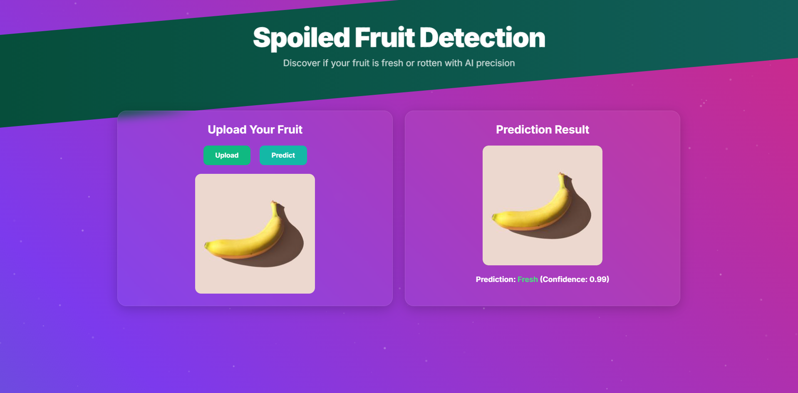
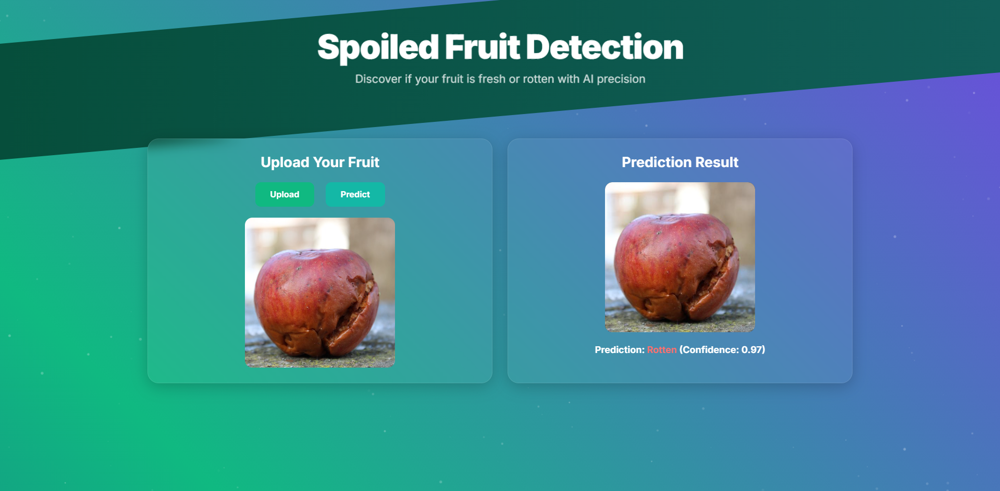

# Spoiled Fruit Detection

## Overview
Spoiled Fruit Detection is a computer vision project that classifies fruits as **Fresh** or **Rotten** using a TensorFlow-based CNN, enhanced by fractional codes and the Potentials Method. A Flask web app provides real-time predictions, ideal for agricultural quality control.




## Features
- Classifies fruits as Fresh or Rotten with high accuracy.
- Uses fractional codes and Potentials Method for feature extraction.
- Flask app for user-friendly image uploads and predictions.
- Visualizes features.

## Technologies
- **Python**: TensorFlow, Keras, OpenCV, Flask
- **Tools**: Jupyter Notebook, Git

## Installation
1. **Clone Repository**:
   ```bash
   git clone https://github.com/AdiyanAndranik/Spoiled-Fruit-Detection.git
   cd spoiled-fruit-detection
   ```

2. **Set Up Environment**:
   ```bash
   python -m venv venv
   source venv/bin/activate  # Windows: venv\Scripts\activate
   pip install -r requirements.txt
   ```

3. **Train Model**:
   ```bash
   python training_pipeline.py
   ```

4. **Run Flask App**:
   ```bash
   python app.py
   ```
   - Visit `http://localhost:8080` to upload images.

5. **Train the model (optional)**:
   ```bash
   http://localhost:8080/train
   ```


## Usage
- **Train**: Visit `http://localhost:8080/train` to train the model via the Flask app, if needed.
- **Predict**: Use the Flask app at `http://localhost:8080` to upload fruit images for classification.

## Dataset
Uses a 2.1 GB dataset of fruit images (not included).

